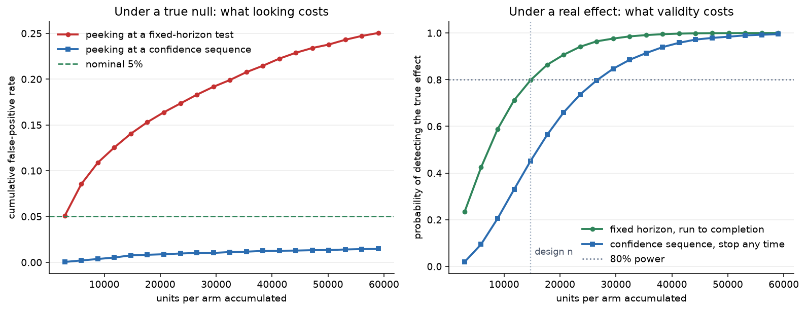
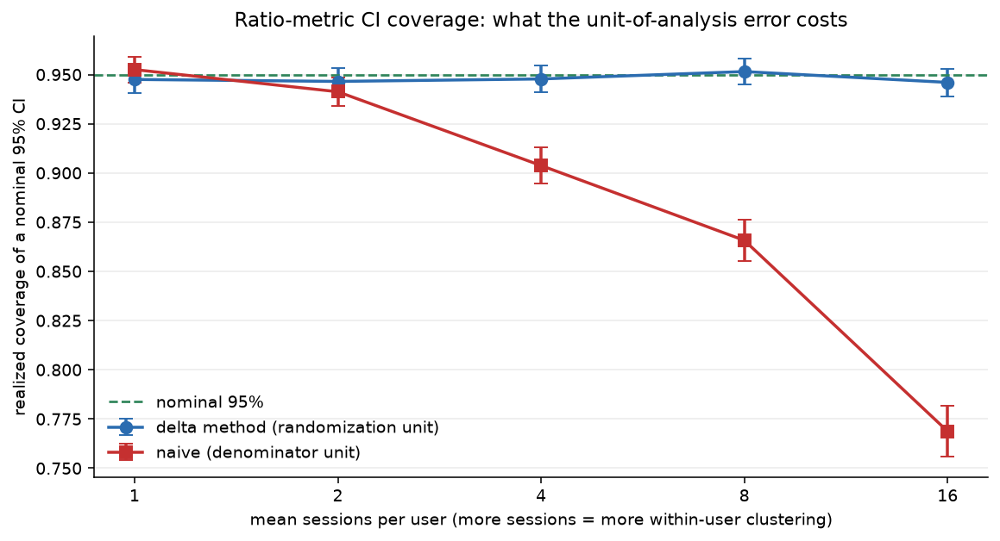
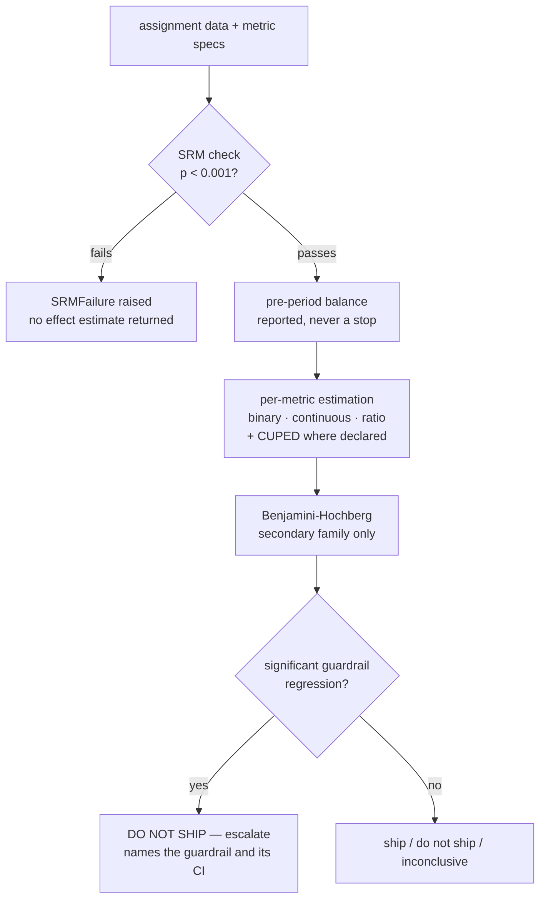

# expkit — a simulation-validated experimentation framework

A production-shaped A/B testing analysis library. Most experimentation repos have the same feature
list. The difference here is that **every estimator is empirically verified to recover known ground
truth, and the verification is committed to the repo.** Clone it, run `make sim`, and check the claims
yourself in about a minute.

Five simulation studies, 11 Type I scenarios, 219 tests. Every simulated rate is reported with a Monte
Carlo standard error, because "Type I error was 5.02%" is not a validation — you cannot tell 5.02% from
5% without knowing whether the noise is 0.1% or 1%.

---

## Two findings

### Peeking costs 5× your false-positive rate. Fixing it costs 1.8× your sample.



An analyst checks the dashboard daily and stops when it goes significant. That feels like diligence.
Simulated under a **true null**, 5,000 experiments, 20 looks each:

| procedure | false-positive rate |
|---|---|
| one look at the planned horizon | 4.8% ± 0.3% |
| **peeking at a fixed-horizon test** | **25.0% ± 0.6%** |
| peeking at an asymptotic confidence sequence | 1.5% ± 0.2% |

One in four "wins" found by peeking is noise. The analyst's behaviour is identical in rows two and
three — only the interval changes.

And the bill, which most write-ups skip: for 80% power on the same effect, the fixed-horizon test needs
**14,840** units per arm and the confidence sequence needs **26,739** — **1.80×**. A single-look
comparison would predict worse (the sequence is 1.55× wider at its tuned size, and power scales with the
square of width, so ~2.40×); the sequence does better than that because it gets 20 chances to cross
instead of one. Repeated looks are the cost under the null and a partial refund under the alternative.

### Ratio-metric intervals silently stop covering, and nothing tells you.



Clicks per session, randomized by user, analysed by session. The delta-method interval holds nominal
coverage at every clustering level. The naive one — treating sessions as independent observations —
degrades with clustering and never says so:

| mean sessions per user | delta method | naive |
|---|---|---|
| 1 | 94.8% | 95.3% |
| 2 | 94.7% | 94.1% |
| 4 | 94.8% | 90.4% |
| 8 | 95.2% | 86.6% |
| 16 | 94.6% | **76.9%** |

At 16 sessions per user, one in 4.3 "95% confident" readouts is wrong against the one in 20 the label
promises. Note the top row: with one session per user the naive estimator is *correct*, because there
the session **is** the randomization unit. That is the tell — the bug is not in the arithmetic, it is in
the choice of what counts as an observation.

Both estimators return the same point estimate. The error is invisible in the headline number.

---

## What it refuses to do

The refusals are the design, not gaps in it.

1. **No result without an uncertainty interval.** Every estimator returns a point estimate, a
   confidence interval, and a p-value together, or it returns nothing.
2. **A failed validity check stops the readout.** SRM below p=0.001 raises; no treatment effect is
   returned at all. SRM means the randomization or the logging is broken → the arms are not
   exchangeable → the comparison is not causal → the estimate is meaningless *regardless of its
   p-value*. Printing it beside a warning only invites someone to read it.
3. **No default alpha, no default power, no one-sided option.** Required arguments, every call.
4. **A significant guardrail regression blocks the ship**, regardless of what the primary did, and
   demands an explicit human override. Guardrails are constraints, not terms in an objective function.
5. **No simulated rate without its Monte Carlo standard error.**



---

## Quickstart

```bash
make setup    # uv venv on Python 3.11 + editable install
make test     # 219 tests, ~2s
make sim      # 5 studies, ~50s, regenerates every artifact in results/
make app      # Streamlit readout interface
make lint     # ruff + black
```

Two runnable walkthroughs:

```bash
.venv/bin/python examples/m1_walkthrough.py        # design + assignment
.venv/bin/python examples/readout_walkthrough.py   # full pipeline, 4 scenarios
```

---

## The readout

```python
from expkit.metrics.base import MetricRole, MetricSpec, MetricType
from expkit.readout import BinaryObservation, ContinuousObservation, readout

result = readout(
    observations=[
        BinaryObservation(
            MetricSpec("checkout_conversion", MetricType.BINARY, MetricRole.PRIMARY),
            successes_control=6_000, n_control=60_000,
            successes_treatment=6_348, n_treatment=60_000,
        ),
        ContinuousObservation(
            MetricSpec("page_load_ms", MetricType.CONTINUOUS, MetricRole.GUARDRAIL,
                       higher_is_better=False),
            control=latency_control, treatment=latency_treatment,
        ),
    ],
    intended_allocation={"control": 0.5, "treatment": 0.5},
    observed_counts={"control": 60_000, "treatment": 60_000},
    alpha=0.05,
    duration_days=14,
)
result.recommendation.decision              # Decision.DO_NOT_SHIP
result.recommendation.requires_human_override   # True
```

```
  DECISION: DO NOT SHIP
  Do not ship without an explicit override. The primary metric improved
  significantly, but 1 guardrail(s) regressed significantly. Guardrails are
  constraints, not quantities to trade against the primary; this readout will
  not price that exchange for you.

  role      metric                  estimate                    95% CI        p    adj p   sig
  --------------------------------------------------------------------------------------------
  primary   checkout_conversion      +0.0058        [+0.0024, +0.0092]   0.0009   0.0009  True
  guardrail page_load_ms             +4.9992        [+3.6384, +6.3601]   0.0000   0.0000  True
  secondary revenue_per_user         +0.6531        [+0.4948, +0.8113]   0.0000   0.0000  True
  secondary clicks_per_session       +0.0062        [+0.0035, +0.0088]   0.0000   0.0000  True

  CUPED on 'revenue_per_user': rho=+0.707, variance reduction 49.9%
```

`readout()` raises `SRMFailure` instead of returning, when the allocation does not check out.

---

## Components

| Module | What it does | How it is verified |
|---|---|---|
| `design/power.py` | Power, MDE, sample size for binary / continuous / ratio; absolute and relative lift; unequal allocation via κ | Matches published reference values exactly (3,841/arm for 10%→12%); round-trips through `power_for_n` and `mde` |
| `design/assignment.py` | `sha256(salt + ":" + unit_id)` → `[0,1)` → bucket | Stable across subprocesses under different `PYTHONHASHSEED`; marginals within 4 MC SE across five splits; independence over 1,035 experiment pairs |
| `validity/srm.py` | Chi-square SRM as a hard stop at p<0.001 | A test asserting the raise, and that no readout object comes back |
| `validity/checks.py` | Pre-period balance (report-only); opt-in pooled winsorization | Per-arm-cutoff trap pinned by test |
| `metrics/ratio.py` | Delta-method variance at the randomization unit | Analytic SE matches empirical spread to **1.0055**; coverage table above |
| `metrics/cuped.py` | Variance reduction on a pre-period covariate, θ pooled across arms | Realized reduction tracks 1−ρ² within 1.4 MC SE across the sweep; estimator unbiased within 1.4 MC SE |
| `inference/fixed.py` | Two-proportion and Welch, unpooled variance for p and CI alike | Type I at nominal from n=200 to n=50,000; p-value and interval provably agree |
| `inference/sequential.py` | Asymptotic confidence sequences; ρ chosen by numerical optimization | Peeking study above; anytime FPR ≤ α under 10 repeated looks |
| `inference/multiple.py` | Benjamini–Hochberg over the secondary family | Hand-computed example; monotone adjusted p-values; step-up behaviour pinned |
| `readout.py` | Orchestration and the decision rule | All four D4 branches tested, including the guardrail conflict |

---

## Simulation validation suite

Committed outputs in [`results/`](results/). Every study writes JSON plus a chart.

| Study | Result |
|---|---|
| `study_type1.py` | **PASS** — 11 scenarios across binary, continuous, ratio, and CUPED; every rejection rate within 2.4 MC SE of α |
| `study_coverage.py` | **PASS** — delta-method coverage nominal at all clustering levels; naive falls to 76.9% |
| `study_power.py` | **PASS** — empirical power matches analytic prediction on data that violates its normality assumption |
| `study_cuped.py` | **PASS** — reduction tracks 1−ρ² (80.4% realized vs 81.0% at ρ=0.9); estimator unbiased; guard fires at 0.00107 against its 0.001 threshold |
| `study_peeking.py` | **PASS** — FPR 4.8% → 25.0% → 1.5%; cost 1.80× quantified |

**Reproducibility is enforced, not hoped for.** Every study seeds `numpy.random.default_rng(seed)`
explicitly, and `tests/test_scaffold.py` fails the build if any file under `src/` or `sims/` touches the
legacy global `np.random.*` API — that API shares one process-wide state, so adding or reordering a
study would silently change every downstream draw with no visible symptom. Chart metadata is stripped
so PNGs are stable too. A fresh clone running `make setup && make test && make sim` regenerates all ten
artifacts **byte-for-byte identically** — verified by copying the tree to a clean directory, building a
new environment, and comparing every file. That guarantee is for a fixed platform and dependency set;
CI runs the studies on Linux and gates on them passing, not on matching bytes, since a scipy point
release can move an optimizer result in the sixth decimal.

### Three things the studies found that were not planned

1. **The pooled-variance collapse reverses off 50/50.** Using one variance in both terms of the
   two-proportion sample-size formula is conservative at equal allocation (+0.03%, which is why it
   survives code review) but **under-sizes the control arm by 27.9% on a 91/9 ramp** — Jensen's
   inequality does not survive the transposed weights. (D8)
2. **A multiplicative treatment effect breaks the equal-variance design formula.** A 15% revenue lift
   scales the treatment arm's variance by (1+lift)², so the formula promises 20.3% power and the
   experiment delivers 18.2%. Feeding it the averaged variance predicts 18.15% — agreement restored.
3. **Welch is conservative on heavy-tailed revenue at small n.** 4.5% rejection against a nominal 5% at
   n=200 on zero-inflated lognormal data. Within Monte Carlo error, but consistently on the safe side.

---

## Method decisions

Eleven decisions in [`DECISIONS.md`](DECISIONS.md), each with its rationale **and the alternative that
was rejected, argued at its strongest**.

| | Decision | Short reason |
|---|---|---|
| D1 | SRM hard stop at **p < 0.001** | Runs on every experiment; at ~1,000/yr that is ~1 false stop annually. At 0.05 it is ~50, analysts learn to override, and the stop stops meaning anything. |
| D2 | **Asymptotic confidence sequences**, not mSPRT | Works on any asymptotically normal estimator, so ratio and CUPED share one code path. Its ρ asks for your planned sample size; mSPRT's mixing variance asks for the effect size you are running the experiment to learn. |
| D3 | Three families: primary uncorrected, secondaries BH, **guardrails excluded** | For a guardrail you want power to *detect harm*, and FDR correction suppresses exactly that. A false alarm costs one investigation; a miss ships a regression. |
| D4 | Guardrail regression **blocks and escalates** | Trading a guardrail against the primary needs an exchange rate this library has no standing to invent. |
| D5 | **Two-sided** only | A one-sided test cannot see that the treatment hurt, and nobody can honestly pre-commit to ignoring a large negative effect. |
| D6 | **No continuity correction** | The analysis is uncorrected; correcting only the design makes `required_n` inconsistent with the test it sizes for. |
| D7 | Allocation as **κ = n_treatment / n_control** | The form the literature states, so each formula is checkable against a published reference. |
| D8 | Pooled-null variance in the α term, alternative variance in the power term | See finding 1 above. |
| D9 | **Unpooled variance for both p and CI** | Guarantees `p < α` ⟺ interval excludes zero. The readout depends on that coherence; the cost is measured, not assumed (+0.0055 power vs prediction). |
| D10 | Outlier trimming **off by default**, pooled cutoff when enabled | Trimming changes the estimand. A per-arm cutoff would trim exactly the effect being measured. |
| D11 | CUPED covariate guard: **hard raise at p < 0.001** | Contamination biases toward zero *while tightening the interval* — measured at −60.4%. Output that looks better while being wrong cannot be a warning. |

D2, D3, and D4 are still marked **PROPOSED**: they were delegated rather than chosen, and the repo owner
should sign them off or overrule them before presenting this work.

---

## Repository layout

```
experimentation/
├── DECISIONS.md              11 decisions, each with its rejected alternative
├── Makefile                  setup / test / sim / app / lint
├── examples/
│   ├── m1_walkthrough.py     design + assignment, computed live
│   └── readout_walkthrough.py  full pipeline across four scenarios
├── src/expkit/
│   ├── design/               power.py · assignment.py
│   ├── validity/             srm.py · checks.py
│   ├── metrics/              base.py · ratio.py · cuped.py
│   ├── inference/            fixed.py · sequential.py · multiple.py
│   └── readout.py            orchestration → structured result
├── sims/                     _report.py · dgp.py · five studies
├── results/                  committed JSON + charts
├── tests/                    219 tests
└── app/streamlit_app.py      thin UI; no statistics live here
```

Python 3.11+. Runtime: numpy, scipy, pandas, statsmodels, matplotlib. Streamlit is an optional `[app]`
extra so the library imports without it.
